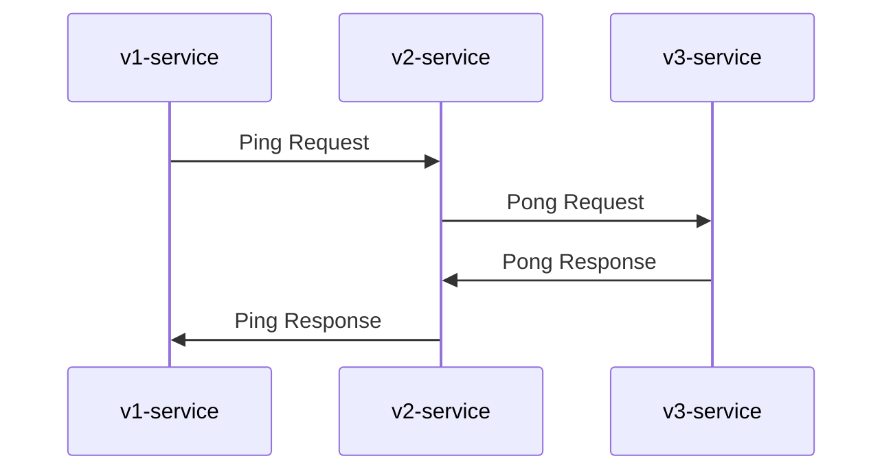
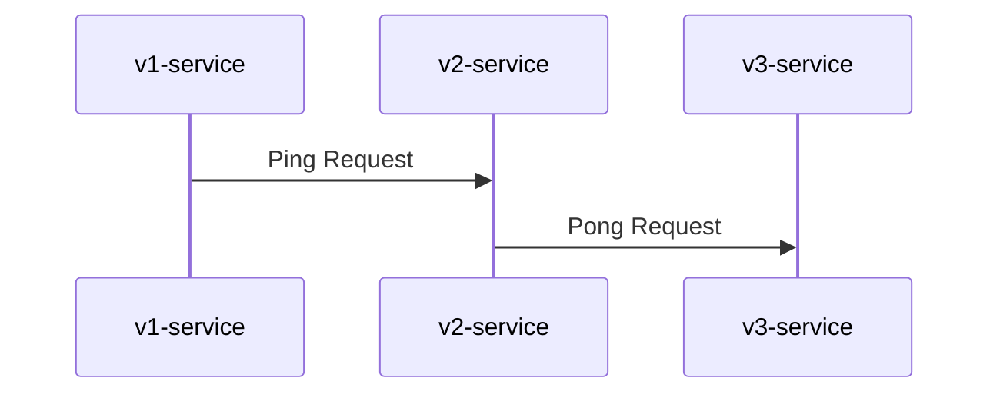

## jigsaw


Jigsaw is an open-source tool that allows you to generate sequence diagrams automatically from Datadog Trace JSON.

### Example

#### w/ response

```bash
$ jigsaw -config ./example/config.yaml ./example/trace.json
%% Generated by https://github.com/upamune/jigsaw
sequenceDiagram
    v1-service->>v2-service: Ping Request
    v2-service->>v3-service: Pong Request
    v3-service->>v2-service: Pong Response
    v2-service->>v1-service: Ping Response
```



Or you can use PlantUML instead of Mermaid by using the type flag.

```bash
$ jigsaw -type plantuml -config ./example/config.yaml ./example/trace.json
' Generated by https://github.com/upamune/jigsaw
@startuml
"v1-service" -> "v2-service": Ping Request
"v2-service" -> "v3-service": Pong Request
"v3-service" -> "v2-service": Pong Response
"v2-service" -> "v1-service": Ping Response
@enduml
```


#### w/o response

```bash
$ jigsaw -config ./example/config.yaml -no-response ./example/trace.json
%% Generated by https://github.com/upamune/jigsaw
sequenceDiagram
    v1-service->>v2-service: Ping Request
    v2-service->>v3-service: Pong Request
```



### Usage

You can get a trace as a JSON via `https://app.datadoghq.com/api/v1/trace/TRACE_ID`.

```bash
$ go get -u github.com/upamune/jigsaw
$ jigsaw trace.json
```

### Configuration

```bash
$ cat config.yaml
include_services:
  - foo-service
  - bar-service
exclude_grpc_services:
  - /foo.bar.v0.Service
grpc_serivce_alias:
  /foo.bar.v1.Service: v1-serivce
  /foo.bar.v2.Service: v2-serivce
```
