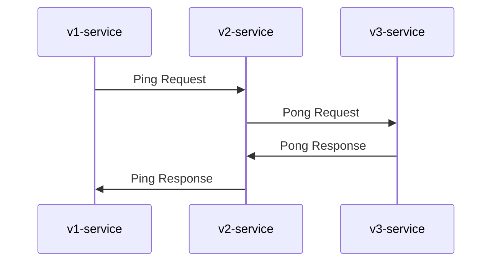
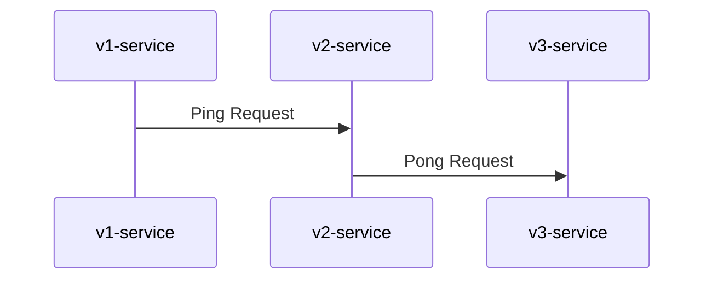

## jigsaw


Jigsaw is an open-source tool that allows you to generate sequence diagrams automatically from Datadog Trace JSON.

### Usage

You can get a trace as a JSON via `https://app.datadoghq.com/api/v1/trace/TRACE_ID`.

> **Pro-tip**
> You can use a handy bookmarklet from [this page](https://upamune.github.io/jigsaw/) to open JSON files from the Trace page

```bash
$ go get -u github.com/upamune/jigsaw
$ jigsaw trace.json
$ jigsaw -help                                                                                (git)-[fix-help-error-handling]
Usage of jigsaw:
  -config string
        path of config
  -debug
        log debug information
  -no-response
        whether to draw response sequences
  -skip-self-call
        whether to skip self call (default true)
  -type string
        output type ('mermaid' or 'plantuml') (default "mermaid")
```

### Example

#### w/ response

```bash
$ jigsaw -config ./example/config.yaml ./example/trace.json
%% Generated by https://github.com/upamune/jigsaw
sequenceDiagram
    v1-service->>v2-service: Ping Request
    v2-service->>v3-service: Pong Request
    v3-service->>v2-service: Pong Response
    v2-service->>v1-service: Ping Response
```



Or you can use PlantUML instead of Mermaid by using the type flag.

```bash
$ jigsaw -type plantuml -config ./example/config.yaml ./example/trace.json
' Generated by https://github.com/upamune/jigsaw
@startuml
"v1-service" -> "v2-service": Ping Request
"v2-service" -> "v3-service": Pong Request
"v3-service" -> "v2-service": Pong Response
"v2-service" -> "v1-service": Ping Response
@enduml
```


#### w/o response

```bash
$ jigsaw -config ./example/config.yaml -no-response ./example/trace.json
%% Generated by https://github.com/upamune/jigsaw
sequenceDiagram
    v1-service->>v2-service: Ping Request
    v2-service->>v3-service: Pong Request
```



### Configuration

The config file is written in YAML format, and the file path is specified with the `-config` flag.
There are options with the same name as some command line flags, but if they are set at the same time, the value of the
command line flag will take precedence.

| Name                  | Description                                                                        | Default |
|-----------------------|------------------------------------------------------------------------------------|---------|
| include_services      | A list of services to include in the diagram. If empty, all services are included. | []      |
| exclude_grpc_services | A list of gRPC services to exclude in the diagram.                                 | []      |
| grpc_service_alias    | A map of gRPC service alias.                                                       | {}      |
| service_alias         | A map of service alias.                                                            | {}      |
| is_skip_self_call     | Whether to skip self call.                                                         | true    |
| no_response           | Whether to draw response sequences.                                                | false   |
| debug                 | Whether to output debug information.                                               | false   |

```bash
$ cat config.yaml
include_services:
  - foo-service
  - bar-service
exclude_grpc_services:
  - /foo.bar.v0.Service
grpc_serivce_alias:
  /foo.bar.v1.Service: v1-serivce
  /foo.bar.v2.Service: v2-serivce
service_alias:
  hoge-mysql: mysql
is_skip_self_call: false
no_response: true
debug: true
```
